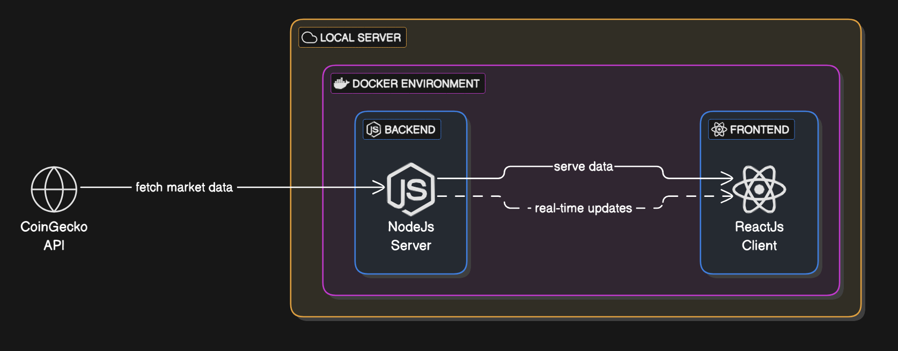

# Introduction to Cryptonite

## Project Overview

Cryptonite is a gateway to understanding the world of cryptocurrency. It provides the insights and tools needed for beginner and advanced traders alike to navigate a rapidly evolving market.
**Note:** Cryptonite is an informational platform only. It does not support cryptocurrency transactions (buying or selling).  

---

## Key Features
- **Real-Time Market Data:** Get up-to-the-minute prices, trends, and historical data for a wide range of cryptocurrencies.

  
### Real-Time Market Data  
- Live cryptocurrency prices, percentage changes, and historical data.  
- Market trends and insights to help users make informed decisions.  


### Market Insights & Analytics  
- Trading volume, market cap, and historical trends.  
- Interactive graphs and charts for visualizing market movements.  

---

## Tech Stack

| Layer         | Technology Used |
|--------------|----------------|
| **Frontend**  | React, TailwindCSS |
| **Backend**   | Node.js, MongoDB |
| **API**       | CoinGecko API |

---

## Structure

```
TT4-Cryptonite/
│
├── client/                    # Frontend (React and TailwindCSS)
│   ├── public/                
│   ├── src/                   
│   │   ├── api/               # Functions for API calls
│   │   ├── assets/            # Images, icons, etc.
│   │   ├── components/        # React components
│   │   ├── contexts/          # Static text content storage
│   │   ├── locales/           # Localization files
│   │   ├── pages/             # Page-level components (Routes)
│   │   ├── utils/             # Localization setup
│   │   ├── App.jsx            # Router for project
│   │   ├── main.jsx           # Entry point of frontend
│   │   └── index.css          # Global styling
│   └── index.html
│  
│
├── server/                    # Backend (Node.js)
│   ├── models/                # Mongoose models
│   │   ├── CoinDetails.js
│   │   ├── CryptoMarketData.js
│   │   └── HistoricalDetail.js
│   ├── routes/                # API route handlers
│   │   ├── coin.detail.js
│   │   ├── coin.historical.js
│   │   └── coin.market.js
│   ├── config.js              # Environment variables / DB config
│   └── index.js               # Backend entry point
│
└── dockerfile                 # Docker configuration for app deployment
```

## API Integration 

### **CoinGecko API**  
Cryptonite leverages the **CoinGecko API** to fetch accurate and up-to-date cryptocurrency market data, including:  
✅ Prices  
✅ Market caps  
✅ Historical trends  

---

## 🛠 Planned Features  

### 1️⃣ Core Features  
- **Real-Time Market Data**: Live prices, trends, and historical price charts.  
- **Watchlist**: Bookmark and track favorite cryptocurrencies.  
- **Market Insights & Analytics**: Trading volume, market cap, and interactive data visualization.  

### 2️⃣ UI/UX Enhancements  
- **Responsive Design**: Mobile-friendly interface with TailwindCSS.  
- **Search & Filter**: Quick cryptocurrency lookup and filtering by market trends.  

### 3️⃣ API Integration  
- **CoinGecko API**: Fetch market data, including prices, market caps, and trends.  

---

## Architecture Diagram


## Developers 
- **Christian Denis Marcelin**  
- **Trung Kien Nguyen**  
- **Yunxian Xu**  
- **Jhalil Danilo Roman Soria**  
- **Sarah Leventon**  


